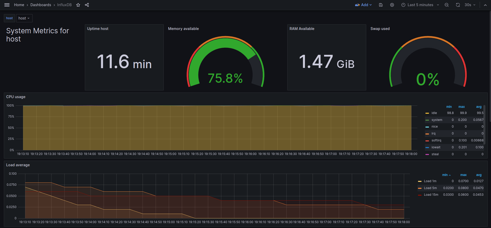
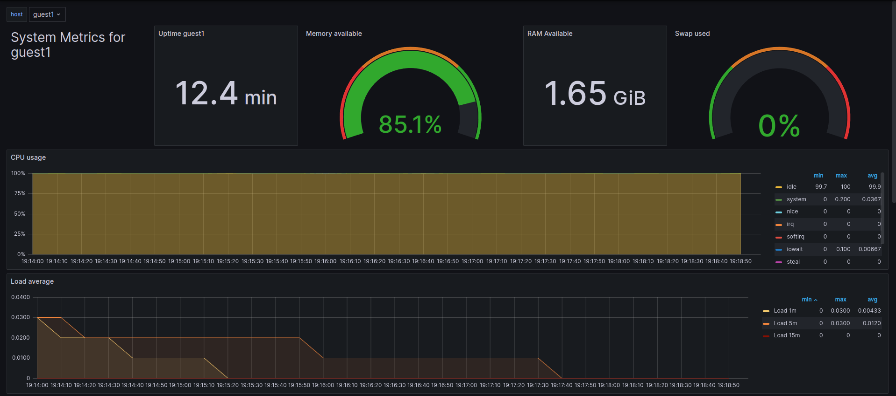

**Toolchain**

- 1. OpenStack
- 2. OpenStack
- 3. GitLab CI/CD
- 4. Terraform + Ansible
- 5. Grafana + usable data source
- 6. Application (tbd)


## Preparation
1. Add a personal token in gitlab:
```
Token name: gitlab-ci-token
Expiration date: empty
Role: Maintainer
Scopes: mark all boxes
```
Copy the generated access token and export it with:
`export GITLAB_CI_TOKEN="your_token"`
You can add this to your .bashrc or .zshrc

2. Create a ssh key in openstack and save the generated file in ~/.ssh
Name: gitlab_ci_cd (mandatory)

3. Create identity key:
```
Name: not relevant
Expiration date: empty
Roles: creator
```
Download the `cloud.yaml` and overwrite it in the cloned repo. `cp ../clouds.yaml terraform/`

## Usage

### 1. Step
Go to terraform directory or/and run:
```
cd terraform
terraform init -backend-config="password=$GITLAB_CI_TOKEN"
```
to initialize the terraform modules.

### 2. Step
Run `terraform plan` to see what terraform will do.

### 3. Step
Run `terraform apply` to apply the changes.

### 4. Step
Export the host fixed ip variable, we need it to send the metrics to host later:
```
export TF_VAR_fixed_ip=$(terraform output host_fixed_ip)
```

### 5. Step: Run ansible to install and configure the needed monitoring packages
Go to ansible directory or/and run:
```
cd ../ansible
# Configure host machine
ansible-playbook -i inventory.yaml host.yaml -e "fixed_ip=${TF_VAR_fixed_ip}" --key-file "~/.ssh/gitlab_ci_cd"

# Configure guest machine
ansible-playbook -i inventory.yaml guest1.yaml -e "fixed_ip=${TF_VAR_fixed_ip}" --key-file "~/.ssh/gitlab_ci_cd"
```

### 6. Step: Open grafana in your browser
Execute `terraform output host_ip` to see the ip of the host. Open your browser and enter the ip with port 3000 like this:\
http://host_ip:3000/login

Enter with:\
Username: admin\
Password: admin

### 6. Step: Import desired dashboard
"Dashboard" > "New" > "Import" > Write "1138" and load > select influxDB and import

Now you can monitor your host:

And your guest machine:


### 7. Step
Run `terraform destroy` to destroy the infrastructure.