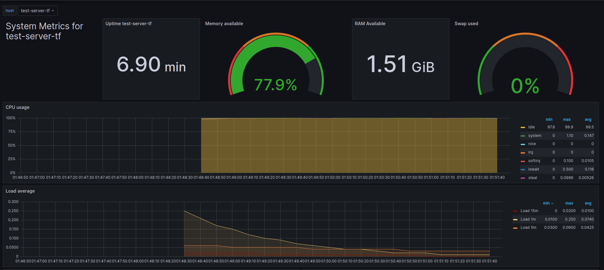

**Toolchain**

- 1. OpenStack
- 2. OpenStack
- 3. GitLab CI/CD
- 4. Terraform + Ansible
- 5. Grafana + usable data source
- 6. Application (tbd)


## Preparation
1. Add a personal token in gitlab:
```
Token name: gitlab-ci-token
Expiration date: empty
Role: Maintainer
Scopes: mark all boxes
```
Copy the generated access token and export it with:
`export GITLAB_TOKEN="your_token"`
You can add this to your .bashrc or .zshrc

2. Create a ssh key in openstack and save the generated file in ~/.ssh
Name: gitlab_ci_cd (mandatory)

3. Create identity key:
```
Name: not relevant
Expiration date: empty
Roles: creator
```
Download the `cloud.yaml` and overwrite it in the cloned repo. `cp ../clouds.yaml terraform/`

## Usage

### 1. Step
Run `terraform init -backend-config="password=$GITLAB_CI_TOKEN"` to initialize the terraform modules.

### 2. Step
Run `terraform plan` to see what terraform will do.

### 3. Step
Run `terraform apply` to apply the changes.

### 4. Step: Run ansible to install and configure the needed monitoring packages
Run:
```
cd ansible
ansible-playbook -i inventory.yaml playbook.yaml --key-file "~/.ssh/gitlab_ci_cd"
```

### 5. Step: Open a local tunnel with your machine to be able to access grafana
```
# Export the ip
cd ../terraform # go to main folder to execute terraform
export TF_VAR_instance_ip=$(terraform output instance_ip | tr -d '"')

# Open local tunel
ssh -L 9999:localhost:3000 -i /home/$USER/.ssh/gitlab_ci_cd debian@$TF_VAR_instance_ip
```

### 6. Step: Open grafana in your browser
Introduce the following url in your browser:
`http://localhost:9999/`

Enter with:\
Username: admin\
Password: admin

### 7. Step: Import desired dashboard
"Dashboard" > "New" > "Import" > Write "1138" and load > select influxDB and import

Now you can monitor your instance:


### Final Step
Run `terraform destroy` to destroy the infrastructure.